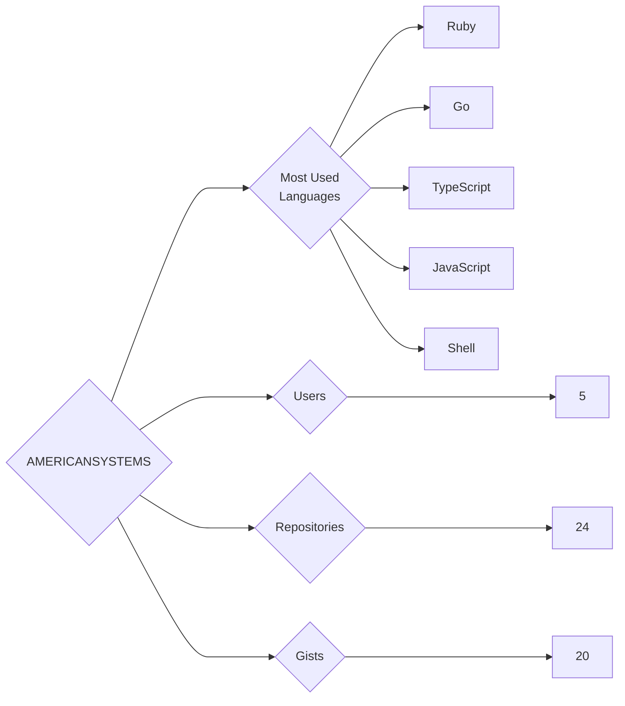

<h1 align="center">AMERICANSYSTEMS</h1>

```mermaid
graph LR
COMPANY_NAME{AMERICANSYSTEMS}
COMPANY_NAME ---> U{Users} ---> UN[5]
COMPANY_NAME ---> R{Repositories} ---> RN[24]
COMPANY_NAME ---> G{Gists} ---> GN[20]
COMPANY_NAME ---> ML{Most Used<br>Languages}
ML --> Ruby[Ruby]
ML --> Go[Go]
ML --> TypeScript[TypeScript]
ML --> JavaScript[JavaScript]
ML --> Shell[Shell]
```
