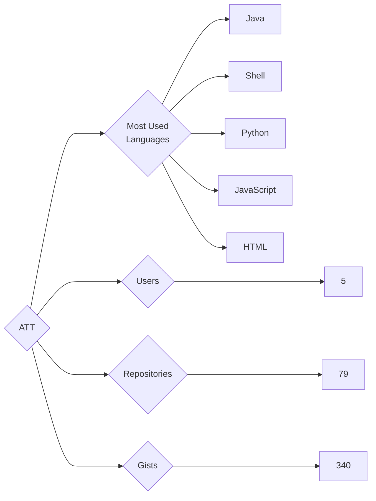

<h1 align="center">ATT</h1>

```mermaid
graph LR
COMPANY_NAME{ATT}
COMPANY_NAME ---> U{Users} ---> UN[5]
COMPANY_NAME ---> R{Repositories} ---> RN[79]
COMPANY_NAME ---> G{Gists} ---> GN[340]
COMPANY_NAME ---> ML{Most Used<br>Languages}
ML --> Java[Java]
ML --> Shell[Shell]
ML --> Python[Python]
ML --> JavaScript[JavaScript]
ML --> HTML[HTML]
```
