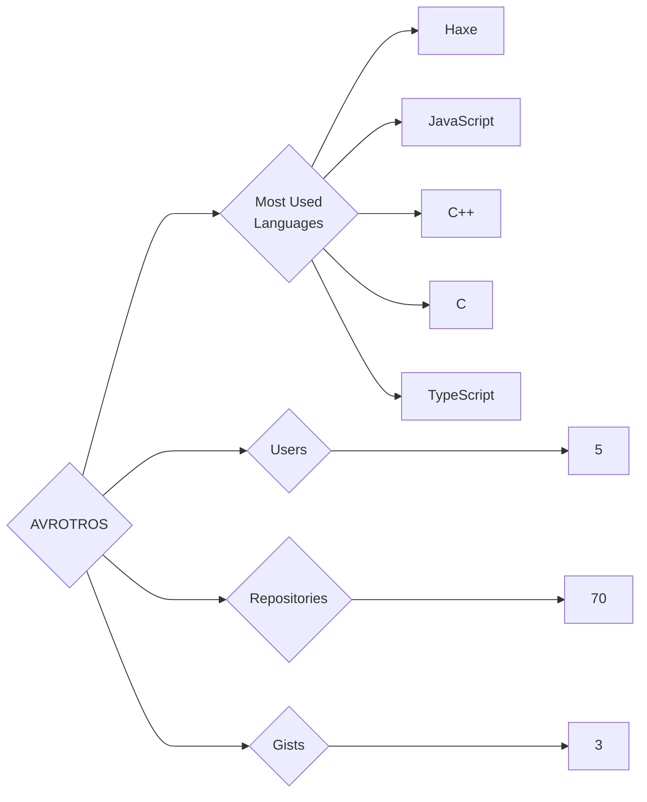

<h1 align="center">AVROTROS</h1>

```mermaid
graph LR
COMPANY_NAME{AVROTROS}
COMPANY_NAME ---> U{Users} ---> UN[5]
COMPANY_NAME ---> R{Repositories} ---> RN[70]
COMPANY_NAME ---> G{Gists} ---> GN[3]
COMPANY_NAME ---> ML{Most Used<br>Languages}
ML --> Haxe[Haxe]
ML --> JavaScript[JavaScript]
ML --> C++[C++]
ML --> C[C]
ML --> TypeScript[TypeScript]
```
