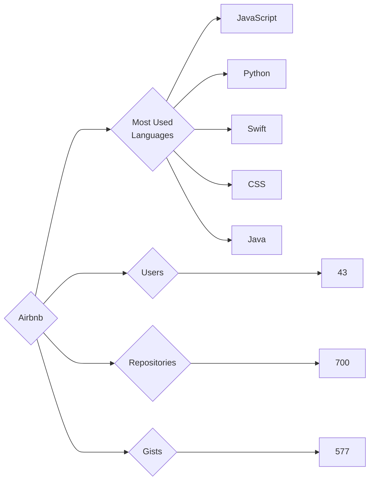

<h1 align="center">Airbnb</h1>

```mermaid
graph LR
COMPANY_NAME{Airbnb}
COMPANY_NAME ---> U{Users} ---> UN[43]
COMPANY_NAME ---> R{Repositories} ---> RN[700]
COMPANY_NAME ---> G{Gists} ---> GN[577]
COMPANY_NAME ---> ML{Most Used<br>Languages}
ML --> JavaScript[JavaScript]
ML --> Python[Python]
ML --> Swift[Swift]
ML --> CSS[CSS]
ML --> Java[Java]
```
