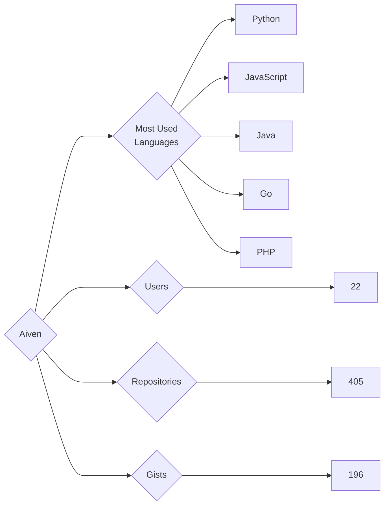

<h1 align="center">Aiven</h1>

```mermaid
graph LR
COMPANY_NAME{Aiven}
COMPANY_NAME ---> U{Users} ---> UN[22]
COMPANY_NAME ---> R{Repositories} ---> RN[405]
COMPANY_NAME ---> G{Gists} ---> GN[196]
COMPANY_NAME ---> ML{Most Used<br>Languages}
ML --> Python[Python]
ML --> JavaScript[JavaScript]
ML --> Java[Java]
ML --> Go[Go]
ML --> PHP[PHP]
```
