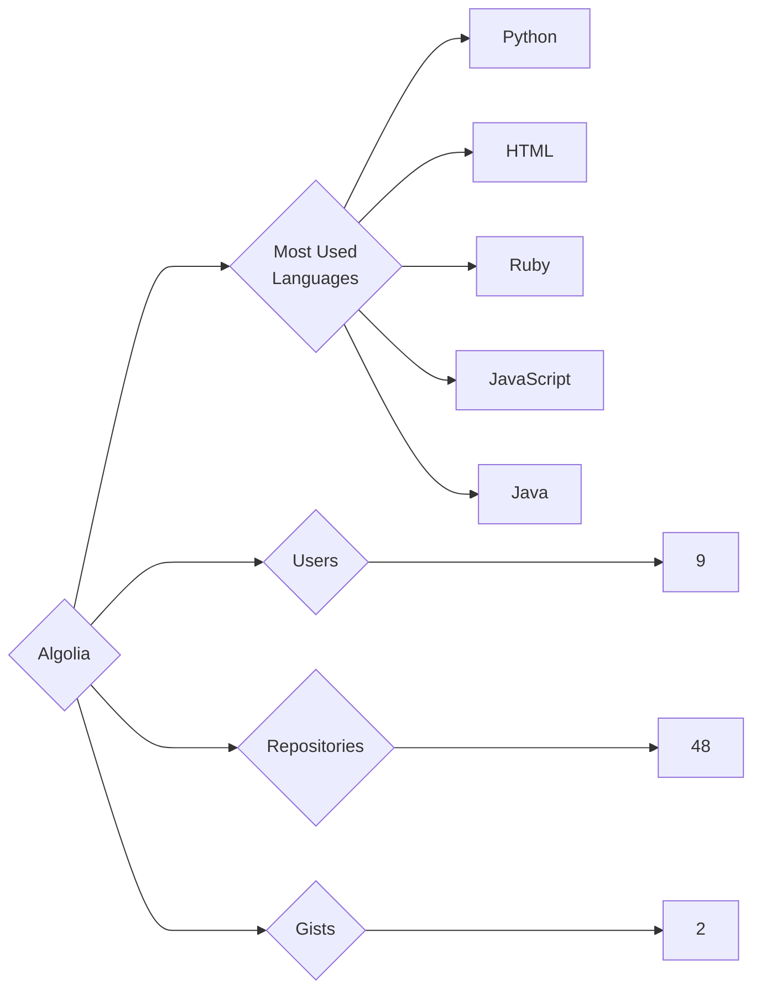

<h1 align="center">Algolia</h1>

```mermaid
graph LR
COMPANY_NAME{Algolia}
COMPANY_NAME ---> U{Users} ---> UN[9]
COMPANY_NAME ---> R{Repositories} ---> RN[48]
COMPANY_NAME ---> G{Gists} ---> GN[2]
COMPANY_NAME ---> ML{Most Used<br>Languages}
ML --> Python[Python]
ML --> HTML[HTML]
ML --> Ruby[Ruby]
ML --> JavaScript[JavaScript]
ML --> Java[Java]
```
