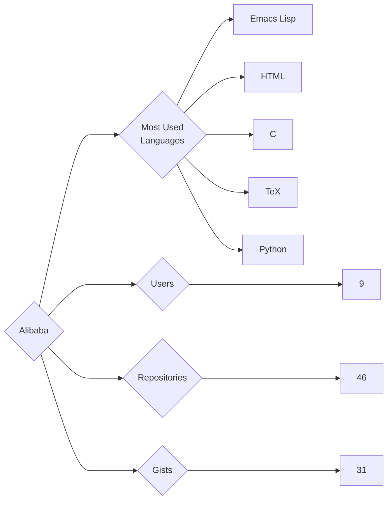

<h1 align="center">Alibaba</h1>

```mermaid
graph LR
COMPANY_NAME{Alibaba}
COMPANY_NAME ---> U{Users} ---> UN[9]
COMPANY_NAME ---> R{Repositories} ---> RN[46]
COMPANY_NAME ---> G{Gists} ---> GN[31]
COMPANY_NAME ---> ML{Most Used<br>Languages}
ML --> Emacs_Lisp[Emacs Lisp]
ML --> HTML[HTML]
ML --> C[C]
ML --> TeX[TeX]
ML --> Python[Python]
```
