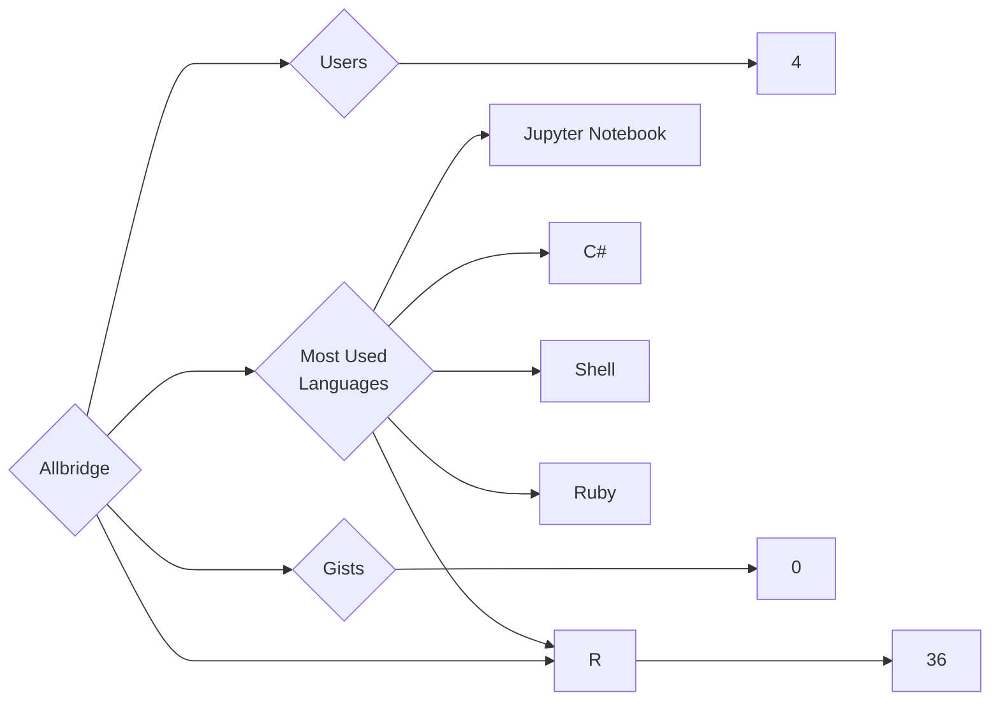

<h1 align="center">Allbridge</h1>

```mermaid
graph LR
COMPANY_NAME{Allbridge}
COMPANY_NAME ---> U{Users} ---> UN[4]
COMPANY_NAME ---> R{Repositories} ---> RN[36]
COMPANY_NAME ---> G{Gists} ---> GN[0]
COMPANY_NAME ---> ML{Most Used<br>Languages}
ML --> Jupyter_Notebook[Jupyter Notebook]
ML --> C#[C#]
ML --> Shell[Shell]
ML --> Ruby[Ruby]
ML --> R[R]
```
