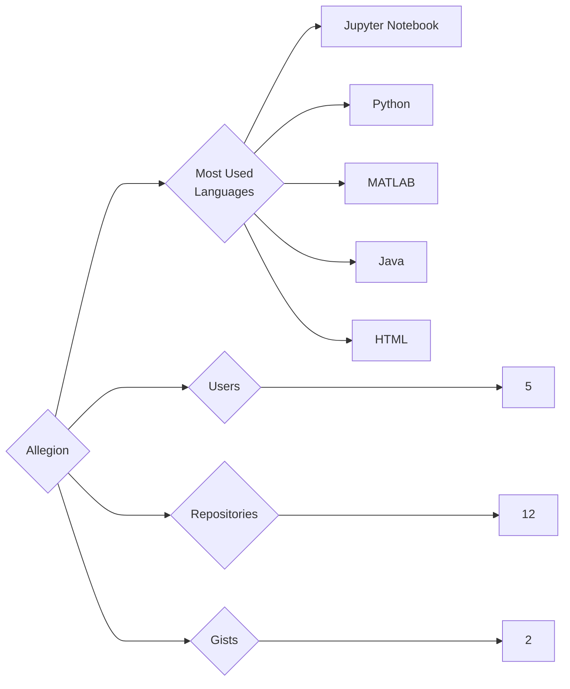

<h1 align="center">Allegion</h1>

```mermaid
graph LR
COMPANY_NAME{Allegion}
COMPANY_NAME ---> U{Users} ---> UN[5]
COMPANY_NAME ---> R{Repositories} ---> RN[12]
COMPANY_NAME ---> G{Gists} ---> GN[2]
COMPANY_NAME ---> ML{Most Used<br>Languages}
ML --> Jupyter_Notebook[Jupyter Notebook]
ML --> Python[Python]
ML --> MATLAB[MATLAB]
ML --> Java[Java]
ML --> HTML[HTML]
```
