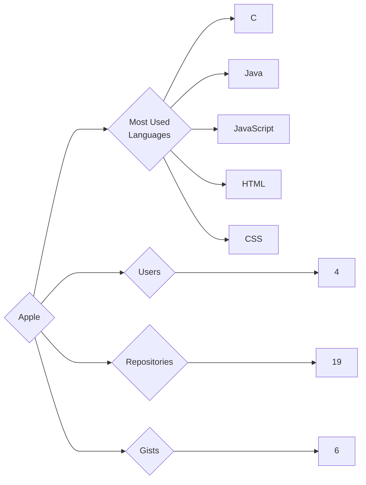

<h1 align="center">Apple</h1>

```mermaid
graph LR
COMPANY_NAME{Apple}
COMPANY_NAME ---> U{Users} ---> UN[4]
COMPANY_NAME ---> R{Repositories} ---> RN[19]
COMPANY_NAME ---> G{Gists} ---> GN[6]
COMPANY_NAME ---> ML{Most Used<br>Languages}
ML --> C[C]
ML --> Java[Java]
ML --> JavaScript[JavaScript]
ML --> HTML[HTML]
ML --> CSS[CSS]
```
