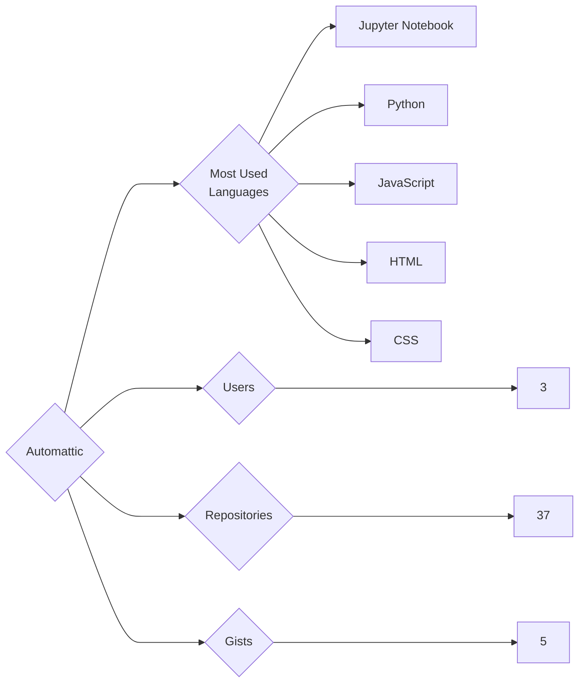

<h1 align="center">Automattic</h1>

```mermaid
graph LR
COMPANY_NAME{Automattic}
COMPANY_NAME ---> U{Users} ---> UN[3]
COMPANY_NAME ---> R{Repositories} ---> RN[37]
COMPANY_NAME ---> G{Gists} ---> GN[5]
COMPANY_NAME ---> ML{Most Used<br>Languages}
ML --> Jupyter_Notebook[Jupyter Notebook]
ML --> Python[Python]
ML --> JavaScript[JavaScript]
ML --> HTML[HTML]
ML --> CSS[CSS]
```
