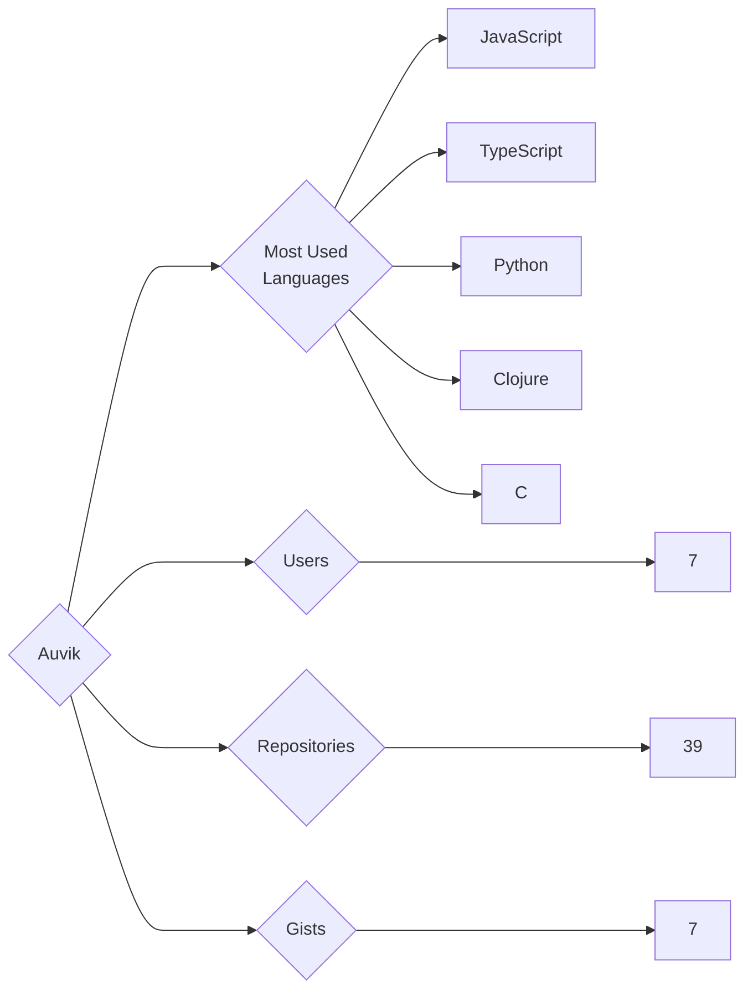

<h1 align="center">Auvik</h1>

```mermaid
graph LR
COMPANY_NAME{Auvik}
COMPANY_NAME ---> U{Users} ---> UN[7]
COMPANY_NAME ---> R{Repositories} ---> RN[39]
COMPANY_NAME ---> G{Gists} ---> GN[7]
COMPANY_NAME ---> ML{Most Used<br>Languages}
ML --> JavaScript[JavaScript]
ML --> TypeScript[TypeScript]
ML --> Python[Python]
ML --> Clojure[Clojure]
ML --> C[C]
```
