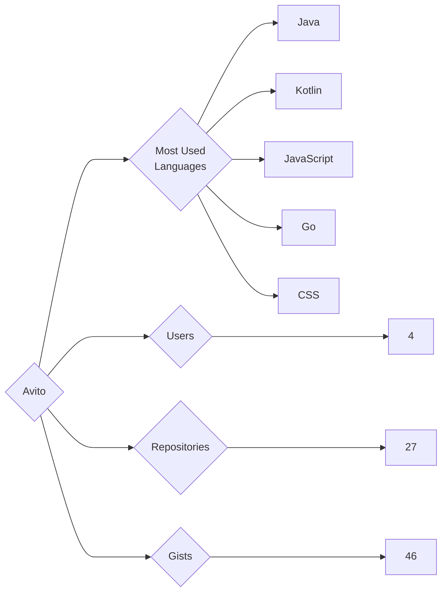

<h1 align="center">Avito</h1>

```mermaid
graph LR
COMPANY_NAME{Avito}
COMPANY_NAME ---> U{Users} ---> UN[4]
COMPANY_NAME ---> R{Repositories} ---> RN[27]
COMPANY_NAME ---> G{Gists} ---> GN[46]
COMPANY_NAME ---> ML{Most Used<br>Languages}
ML --> Java[Java]
ML --> Kotlin[Kotlin]
ML --> JavaScript[JavaScript]
ML --> Go[Go]
ML --> CSS[CSS]
```
