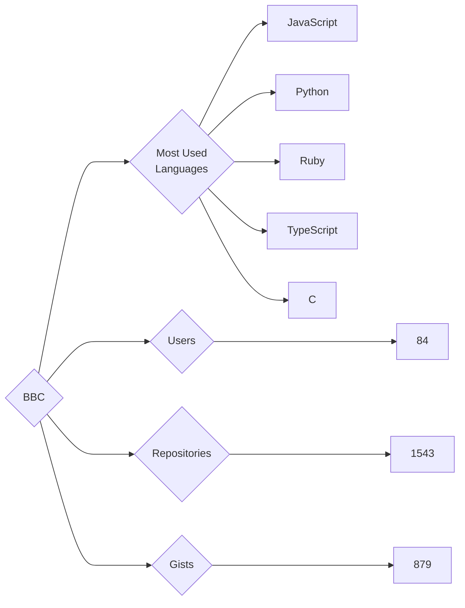

<h1 align="center">BBC</h1>

```mermaid
graph LR
COMPANY_NAME{BBC}
COMPANY_NAME ---> U{Users} ---> UN[84]
COMPANY_NAME ---> R{Repositories} ---> RN[1543]
COMPANY_NAME ---> G{Gists} ---> GN[879]
COMPANY_NAME ---> ML{Most Used<br>Languages}
ML --> JavaScript[JavaScript]
ML --> Python[Python]
ML --> Ruby[Ruby]
ML --> TypeScript[TypeScript]
ML --> C[C]
```
