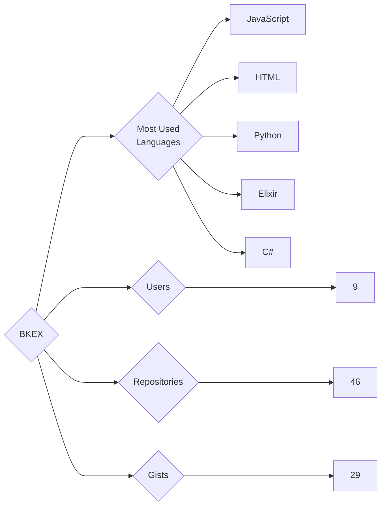

<h1 align="center">BKEX</h1>

```mermaid
graph LR
COMPANY_NAME{BKEX}
COMPANY_NAME ---> U{Users} ---> UN[9]
COMPANY_NAME ---> R{Repositories} ---> RN[46]
COMPANY_NAME ---> G{Gists} ---> GN[29]
COMPANY_NAME ---> ML{Most Used<br>Languages}
ML --> JavaScript[JavaScript]
ML --> HTML[HTML]
ML --> Python[Python]
ML --> Elixir[Elixir]
ML --> C#[C#]
```
