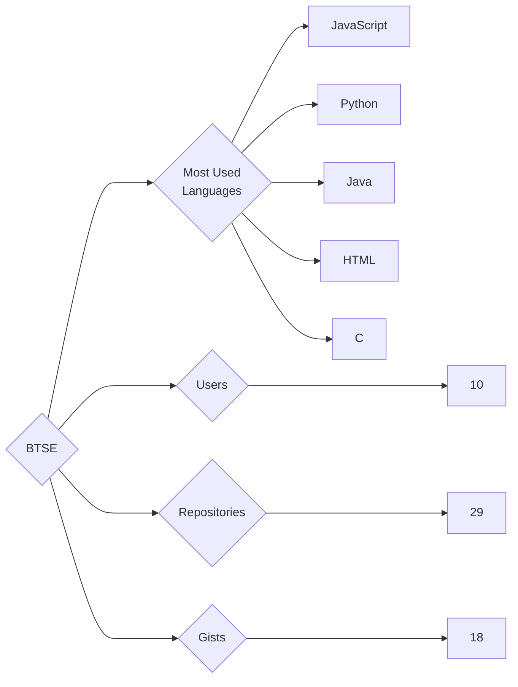

<h1 align="center">BTSE</h1>

```mermaid
graph LR
COMPANY_NAME{BTSE}
COMPANY_NAME ---> U{Users} ---> UN[10]
COMPANY_NAME ---> R{Repositories} ---> RN[29]
COMPANY_NAME ---> G{Gists} ---> GN[18]
COMPANY_NAME ---> ML{Most Used<br>Languages}
ML --> JavaScript[JavaScript]
ML --> Python[Python]
ML --> Java[Java]
ML --> HTML[HTML]
ML --> C[C]
```
