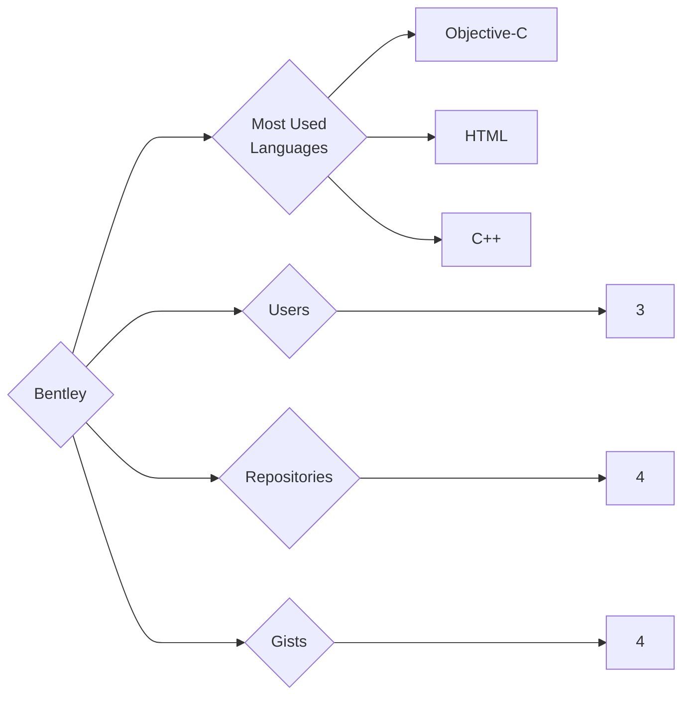

<h1 align="center">Bentley</h1>

```mermaid
graph LR
COMPANY_NAME{Bentley}
COMPANY_NAME ---> U{Users} ---> UN[3]
COMPANY_NAME ---> R{Repositories} ---> RN[4]
COMPANY_NAME ---> G{Gists} ---> GN[4]
COMPANY_NAME ---> ML{Most Used<br>Languages}
ML --> Objective-C[Objective-C]
ML --> HTML[HTML]
ML --> C++[C++]
```
