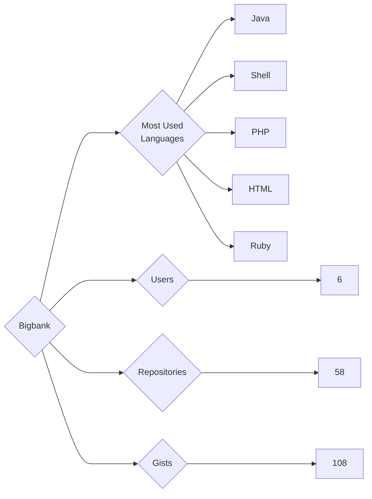

<h1 align="center">Bigbank</h1>

```mermaid
graph LR
COMPANY_NAME{Bigbank}
COMPANY_NAME ---> U{Users} ---> UN[6]
COMPANY_NAME ---> R{Repositories} ---> RN[58]
COMPANY_NAME ---> G{Gists} ---> GN[108]
COMPANY_NAME ---> ML{Most Used<br>Languages}
ML --> Java[Java]
ML --> Shell[Shell]
ML --> PHP[PHP]
ML --> HTML[HTML]
ML --> Ruby[Ruby]
```
