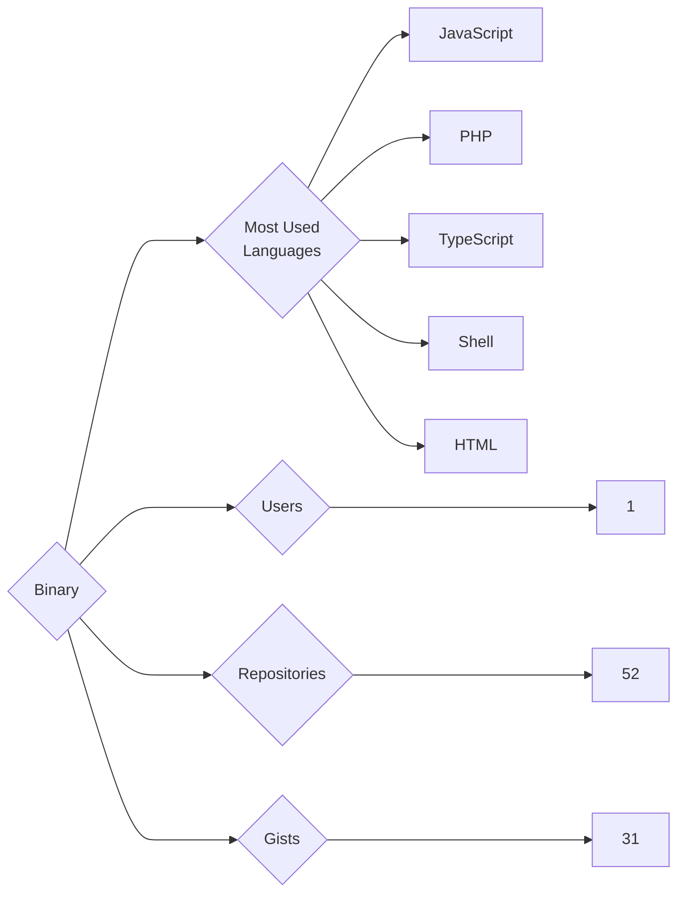

<h1 align="center">Binary</h1>

```mermaid
graph LR
COMPANY_NAME{Binary}
COMPANY_NAME ---> U{Users} ---> UN[1]
COMPANY_NAME ---> R{Repositories} ---> RN[52]
COMPANY_NAME ---> G{Gists} ---> GN[31]
COMPANY_NAME ---> ML{Most Used<br>Languages}
ML --> JavaScript[JavaScript]
ML --> PHP[PHP]
ML --> TypeScript[TypeScript]
ML --> Shell[Shell]
ML --> HTML[HTML]
```
