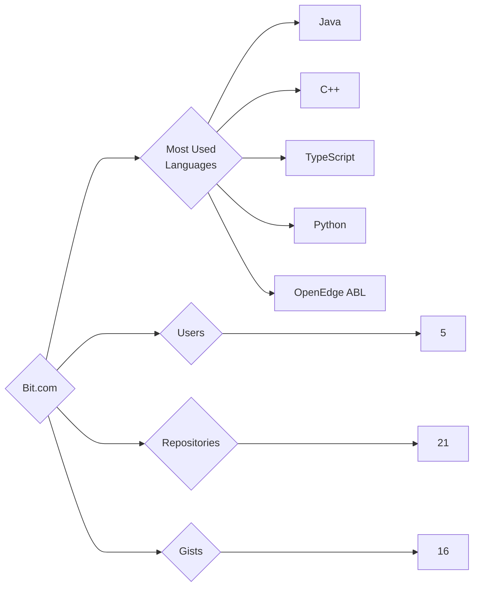

<h1 align="center">Bit.com</h1>

```mermaid
graph LR
COMPANY_NAME{Bit.com}
COMPANY_NAME ---> U{Users} ---> UN[5]
COMPANY_NAME ---> R{Repositories} ---> RN[21]
COMPANY_NAME ---> G{Gists} ---> GN[16]
COMPANY_NAME ---> ML{Most Used<br>Languages}
ML --> Java[Java]
ML --> C++[C++]
ML --> TypeScript[TypeScript]
ML --> Python[Python]
ML --> OpenEdge_ABL[OpenEdge ABL]
```
