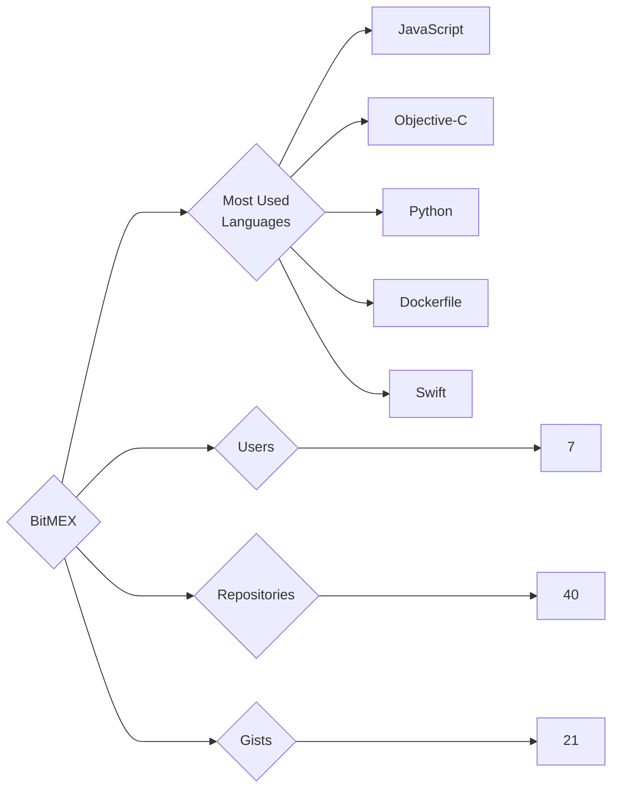

<h1 align="center">BitMEX</h1>

```mermaid
graph LR
COMPANY_NAME{BitMEX}
COMPANY_NAME ---> U{Users} ---> UN[7]
COMPANY_NAME ---> R{Repositories} ---> RN[40]
COMPANY_NAME ---> G{Gists} ---> GN[21]
COMPANY_NAME ---> ML{Most Used<br>Languages}
ML --> JavaScript[JavaScript]
ML --> Objective-C[Objective-C]
ML --> Python[Python]
ML --> Dockerfile[Dockerfile]
ML --> Swift[Swift]
```
