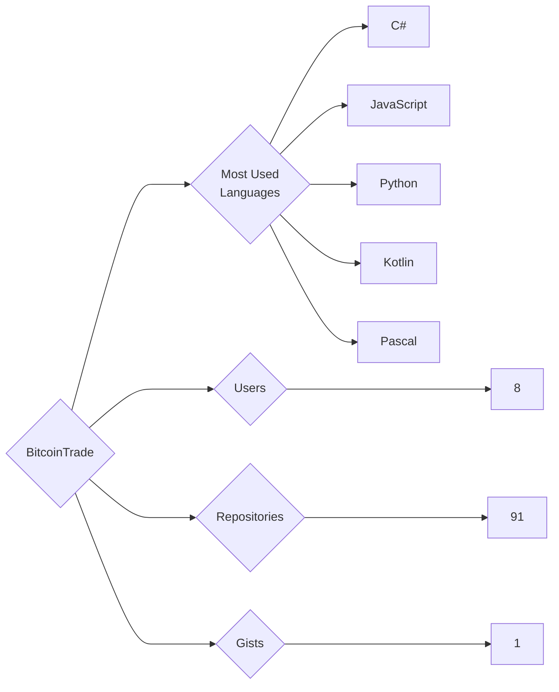

<h1 align="center">BitcoinTrade</h1>

```mermaid
graph LR
COMPANY_NAME{BitcoinTrade}
COMPANY_NAME ---> U{Users} ---> UN[8]
COMPANY_NAME ---> R{Repositories} ---> RN[91]
COMPANY_NAME ---> G{Gists} ---> GN[1]
COMPANY_NAME ---> ML{Most Used<br>Languages}
ML --> C#[C#]
ML --> JavaScript[JavaScript]
ML --> Python[Python]
ML --> Kotlin[Kotlin]
ML --> Pascal[Pascal]
```
