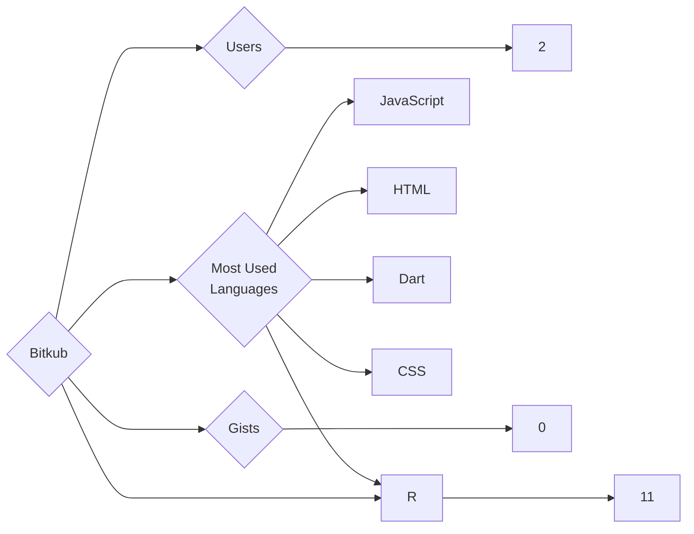

<h1 align="center">Bitkub</h1>

```mermaid
graph LR
COMPANY_NAME{Bitkub}
COMPANY_NAME ---> U{Users} ---> UN[2]
COMPANY_NAME ---> R{Repositories} ---> RN[11]
COMPANY_NAME ---> G{Gists} ---> GN[0]
COMPANY_NAME ---> ML{Most Used<br>Languages}
ML --> JavaScript[JavaScript]
ML --> HTML[HTML]
ML --> Dart[Dart]
ML --> CSS[CSS]
ML --> R[R]
```
