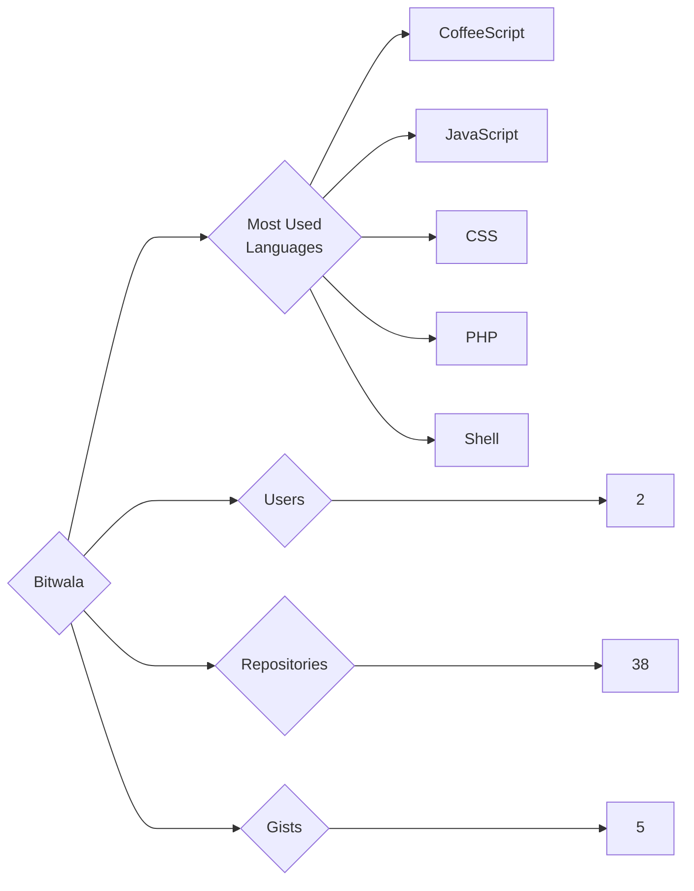

<h1 align="center">Bitwala</h1>

```mermaid
graph LR
COMPANY_NAME{Bitwala}
COMPANY_NAME ---> U{Users} ---> UN[2]
COMPANY_NAME ---> R{Repositories} ---> RN[38]
COMPANY_NAME ---> G{Gists} ---> GN[5]
COMPANY_NAME ---> ML{Most Used<br>Languages}
ML --> CoffeeScript[CoffeeScript]
ML --> JavaScript[JavaScript]
ML --> CSS[CSS]
ML --> PHP[PHP]
ML --> Shell[Shell]
```
