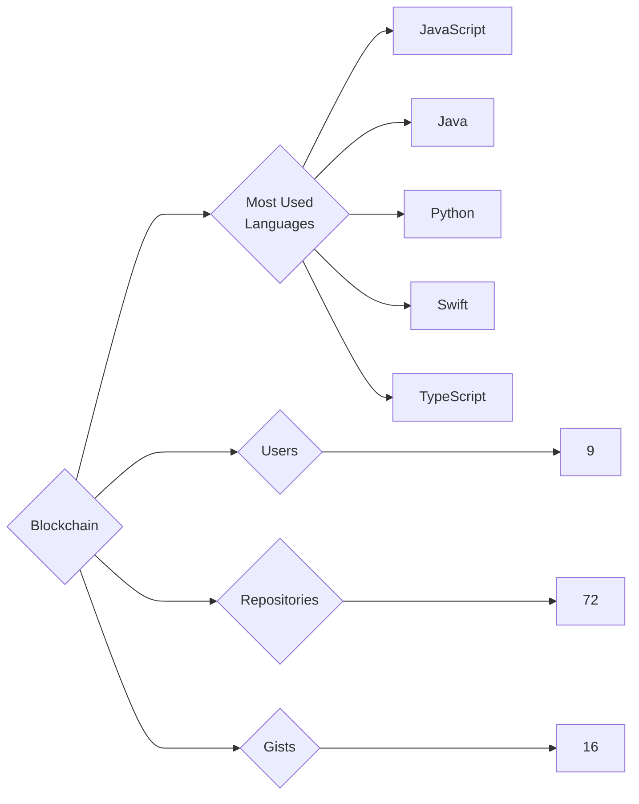

<h1 align="center">Blockchain</h1>

```mermaid
graph LR
COMPANY_NAME{Blockchain}
COMPANY_NAME ---> U{Users} ---> UN[9]
COMPANY_NAME ---> R{Repositories} ---> RN[72]
COMPANY_NAME ---> G{Gists} ---> GN[16]
COMPANY_NAME ---> ML{Most Used<br>Languages}
ML --> JavaScript[JavaScript]
ML --> Java[Java]
ML --> Python[Python]
ML --> Swift[Swift]
ML --> TypeScript[TypeScript]
```
