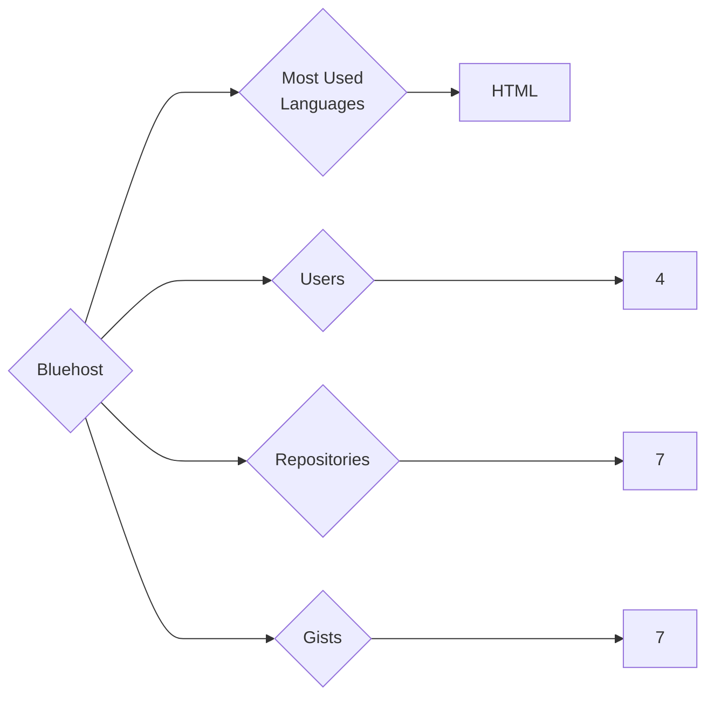

<h1 align="center">Bluehost</h1>

```mermaid
graph LR
COMPANY_NAME{Bluehost}
COMPANY_NAME ---> U{Users} ---> UN[4]
COMPANY_NAME ---> R{Repositories} ---> RN[7]
COMPANY_NAME ---> G{Gists} ---> GN[7]
COMPANY_NAME ---> ML{Most Used<br>Languages}
ML --> HTML[HTML]
```
