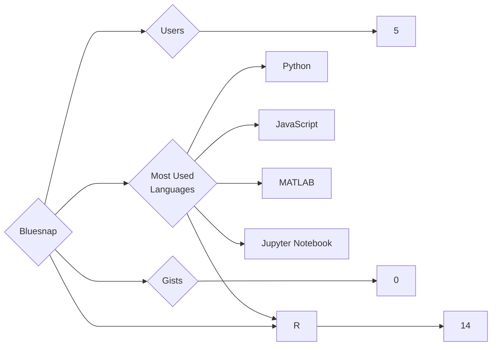

<h1 align="center">Bluesnap</h1>

```mermaid
graph LR
COMPANY_NAME{Bluesnap}
COMPANY_NAME ---> U{Users} ---> UN[5]
COMPANY_NAME ---> R{Repositories} ---> RN[14]
COMPANY_NAME ---> G{Gists} ---> GN[0]
COMPANY_NAME ---> ML{Most Used<br>Languages}
ML --> Python[Python]
ML --> JavaScript[JavaScript]
ML --> R[R]
ML --> MATLAB[MATLAB]
ML --> Jupyter_Notebook[Jupyter Notebook]
```
