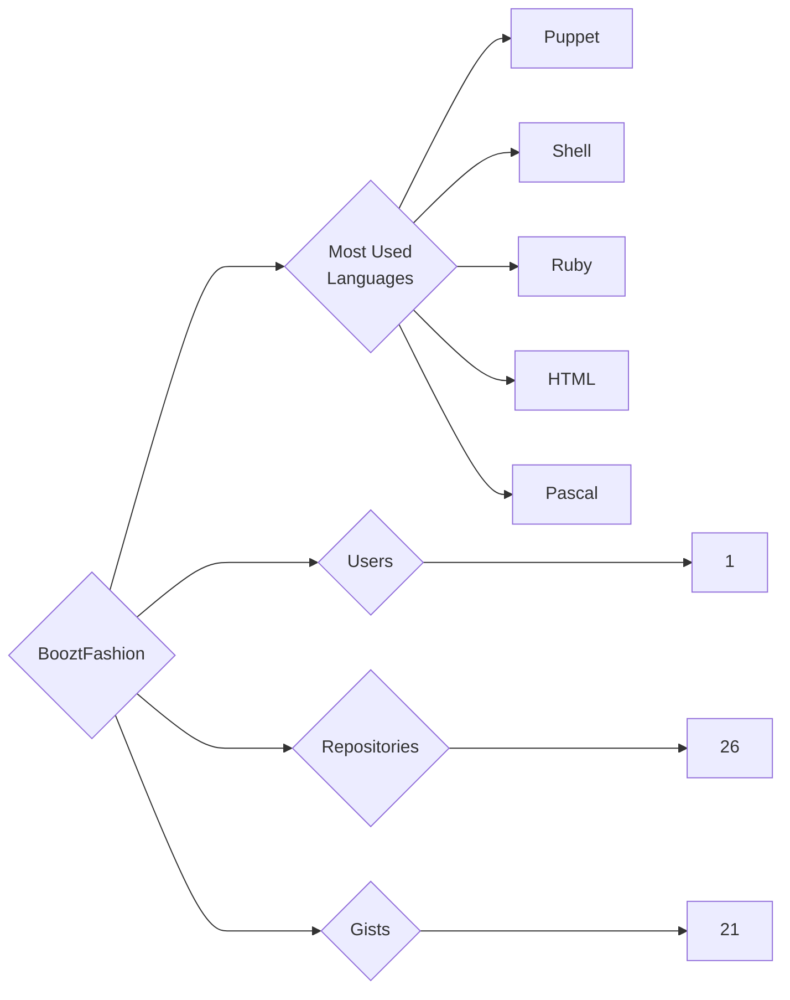

<h1 align="center">BooztFashion</h1>

```mermaid
graph LR
COMPANY_NAME{BooztFashion}
COMPANY_NAME ---> U{Users} ---> UN[1]
COMPANY_NAME ---> R{Repositories} ---> RN[26]
COMPANY_NAME ---> G{Gists} ---> GN[21]
COMPANY_NAME ---> ML{Most Used<br>Languages}
ML --> Puppet
ML --> Shell
ML --> Ruby
ML --> HTML
ML --> Pascal
```
