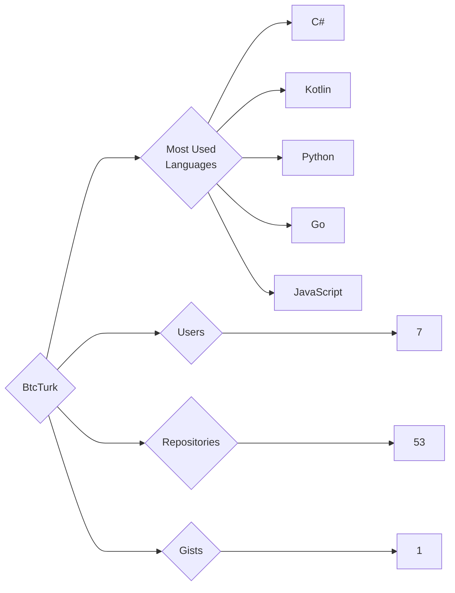

<h1 align="center">BtcTurk</h1>

```mermaid
graph LR
COMPANY_NAME{BtcTurk}
COMPANY_NAME ---> U{Users} ---> UN[7]
COMPANY_NAME ---> R{Repositories} ---> RN[53]
COMPANY_NAME ---> G{Gists} ---> GN[1]
COMPANY_NAME ---> ML{Most Used<br>Languages}
ML --> C#[C#]
ML --> Kotlin[Kotlin]
ML --> Python[Python]
ML --> Go[Go]
ML --> JavaScript[JavaScript]
```
