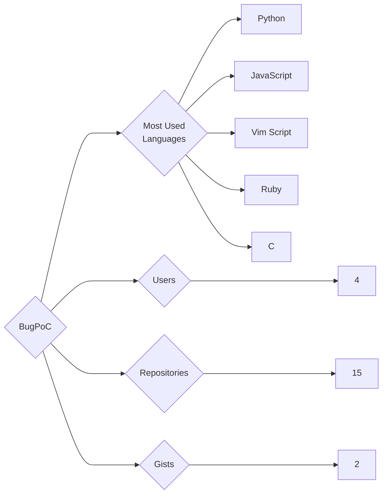

<h1 align="center">BugPoC</h1>

```mermaid
graph LR
COMPANY_NAME{BugPoC}
COMPANY_NAME ---> U{Users} ---> UN[4]
COMPANY_NAME ---> R{Repositories} ---> RN[15]
COMPANY_NAME ---> G{Gists} ---> GN[2]
COMPANY_NAME ---> ML{Most Used<br>Languages}
ML --> Python[Python]
ML --> JavaScript[JavaScript]
ML --> Vim_Script[Vim Script]
ML --> Ruby[Ruby]
ML --> C[C]
```
