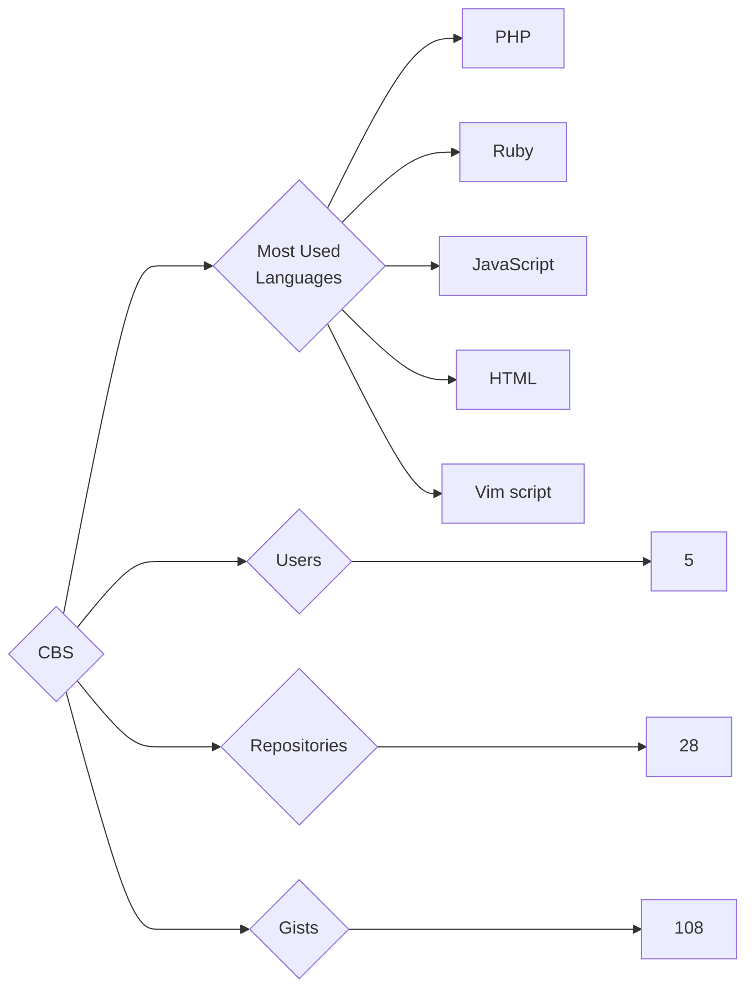

<h1 align="center">CBS</h1>

```mermaid
graph LR
COMPANY_NAME{CBS}
COMPANY_NAME ---> U{Users} ---> UN[5]
COMPANY_NAME ---> R{Repositories} ---> RN[28]
COMPANY_NAME ---> G{Gists} ---> GN[108]
COMPANY_NAME ---> ML{Most Used<br>Languages}
ML --> PHP[PHP]
ML --> Ruby[Ruby]
ML --> JavaScript[JavaScript]
ML --> HTML[HTML]
ML --> Vim_script[Vim script]
```
