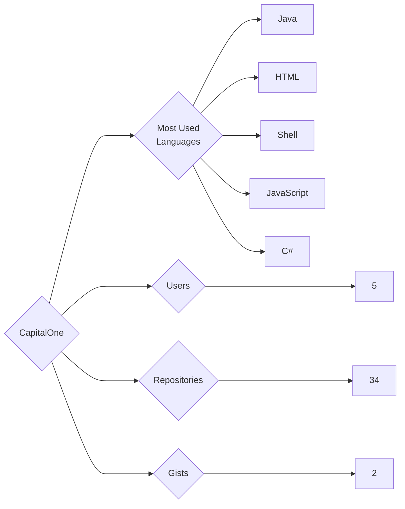

<h1 align="center">CapitalOne</h1>

```mermaid
graph LR
COMPANY_NAME{CapitalOne}
COMPANY_NAME ---> U{Users} ---> UN[5]
COMPANY_NAME ---> R{Repositories} ---> RN[34]
COMPANY_NAME ---> G{Gists} ---> GN[2]
COMPANY_NAME ---> ML{Most Used<br>Languages}
ML --> Java[Java]
ML --> HTML[HTML]
ML --> Shell[Shell]
ML --> JavaScript[JavaScript]
ML --> C#[C#]
```
