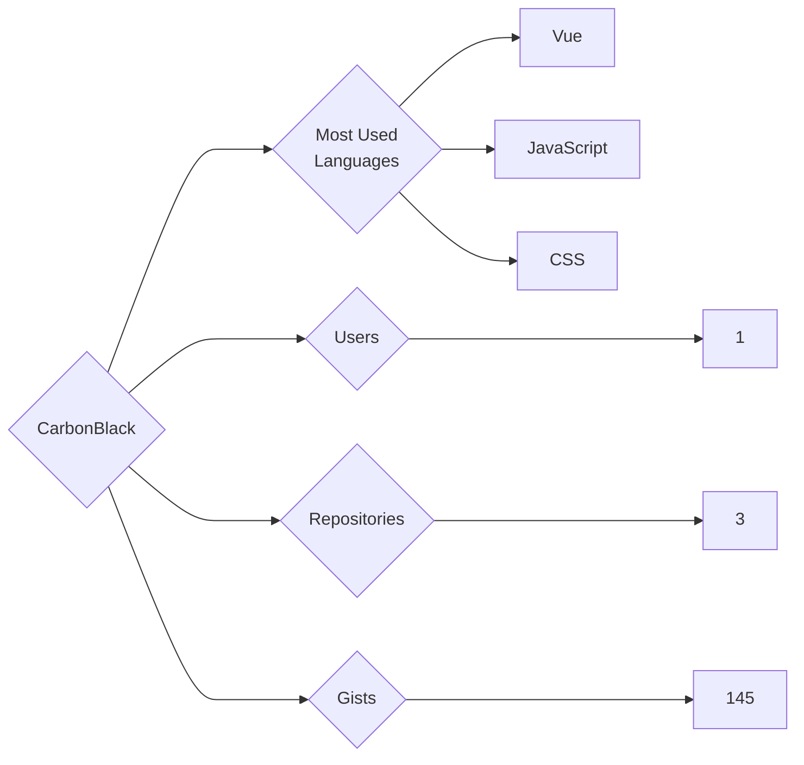

<h1 align="center">CarbonBlack</h1>

```mermaid
graph LR
COMPANY_NAME{CarbonBlack}
COMPANY_NAME ---> U{Users} ---> UN[1]
COMPANY_NAME ---> R{Repositories} ---> RN[3]
COMPANY_NAME ---> G{Gists} ---> GN[145]
COMPANY_NAME ---> ML{Most Used<br>Languages}
ML --> Vue[Vue]
ML --> JavaScript[JavaScript]
ML --> CSS[CSS]
```
