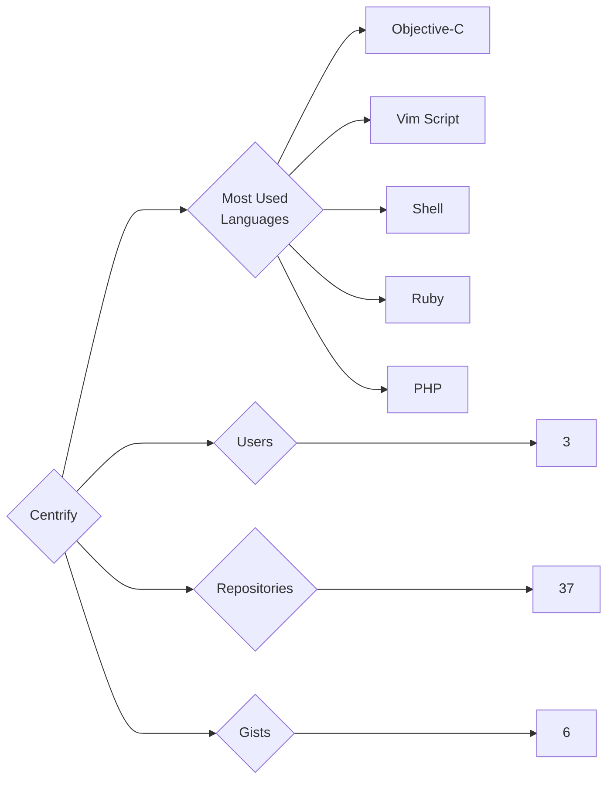

<h1 align="center">Centrify</h1>

```mermaid
graph LR
COMPANY_NAME{Centrify}
COMPANY_NAME ---> U{Users} ---> UN[3]
COMPANY_NAME ---> R{Repositories} ---> RN[37]
COMPANY_NAME ---> G{Gists} ---> GN[6]
COMPANY_NAME ---> ML{Most Used<br>Languages}
ML --> Objective-C[Objective-C]
ML --> Vim_Script[Vim Script]
ML --> Shell[Shell]
ML --> Ruby[Ruby]
ML --> PHP[PHP]
```
