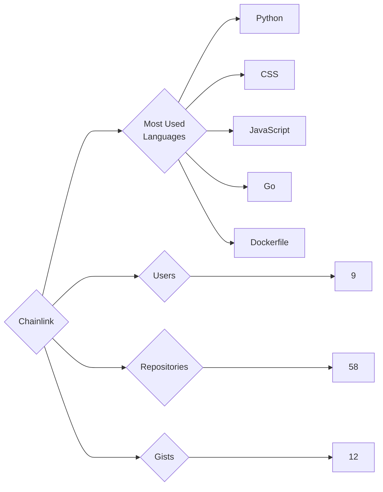

<h1 align="center">Chainlink</h1>

```mermaid
graph LR
COMPANY_NAME{Chainlink}
COMPANY_NAME ---> U{Users} ---> UN[9]
COMPANY_NAME ---> R{Repositories} ---> RN[58]
COMPANY_NAME ---> G{Gists} ---> GN[12]
COMPANY_NAME ---> ML{Most Used<br>Languages}
ML --> Python[Python]
ML --> CSS[CSS]
ML --> JavaScript[JavaScript]
ML --> Go[Go]
ML --> Dockerfile[Dockerfile]
```
