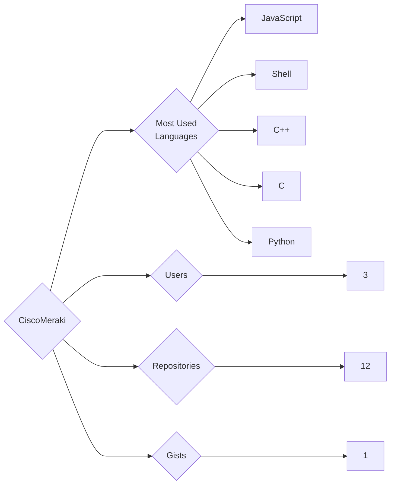

<h1 align="center">CiscoMeraki</h1>

```mermaid
graph LR
COMPANY_NAME{CiscoMeraki}
COMPANY_NAME ---> U{Users} ---> UN[3]
COMPANY_NAME ---> R{Repositories} ---> RN[12]
COMPANY_NAME ---> G{Gists} ---> GN[1]
COMPANY_NAME ---> ML{Most Used<br>Languages}
ML --> JavaScript[JavaScript]
ML --> Shell[Shell]
ML --> C++[C++]
ML --> C[C]
ML --> Python[Python]
```
