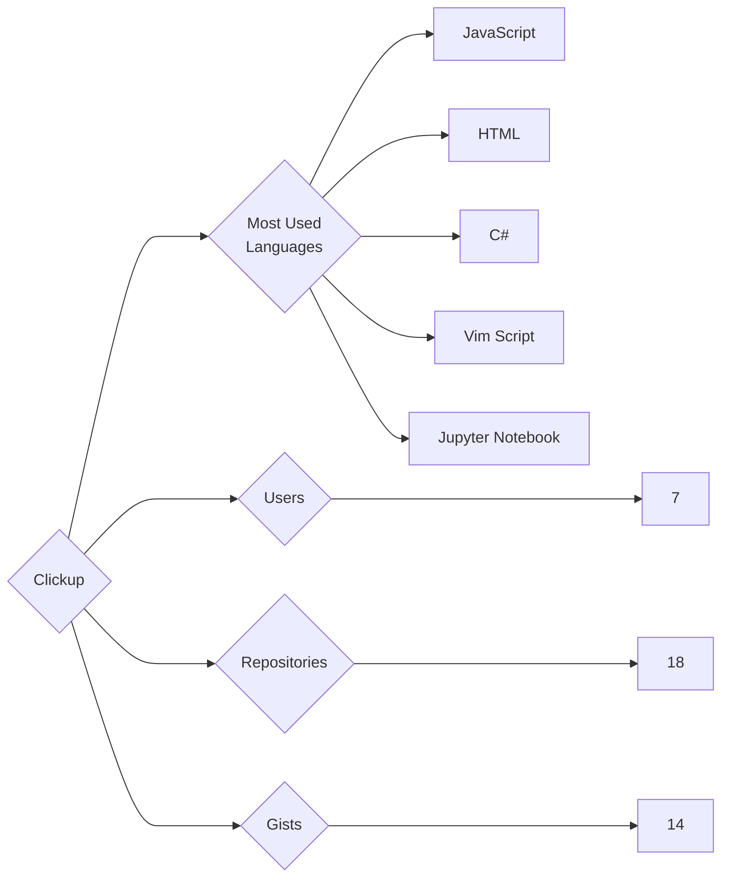

<h1 align="center">Clickup</h1>

```mermaid
graph LR
COMPANY_NAME{Clickup}
COMPANY_NAME ---> U{Users} ---> UN[7]
COMPANY_NAME ---> R{Repositories} ---> RN[18]
COMPANY_NAME ---> G{Gists} ---> GN[14]
COMPANY_NAME ---> ML{Most Used<br>Languages}
ML --> JavaScript[JavaScript]
ML --> HTML[HTML]
ML --> C#[C#]
ML --> Vim_Script[Vim Script]
ML --> Jupyter_Notebook[Jupyter Notebook]
```
