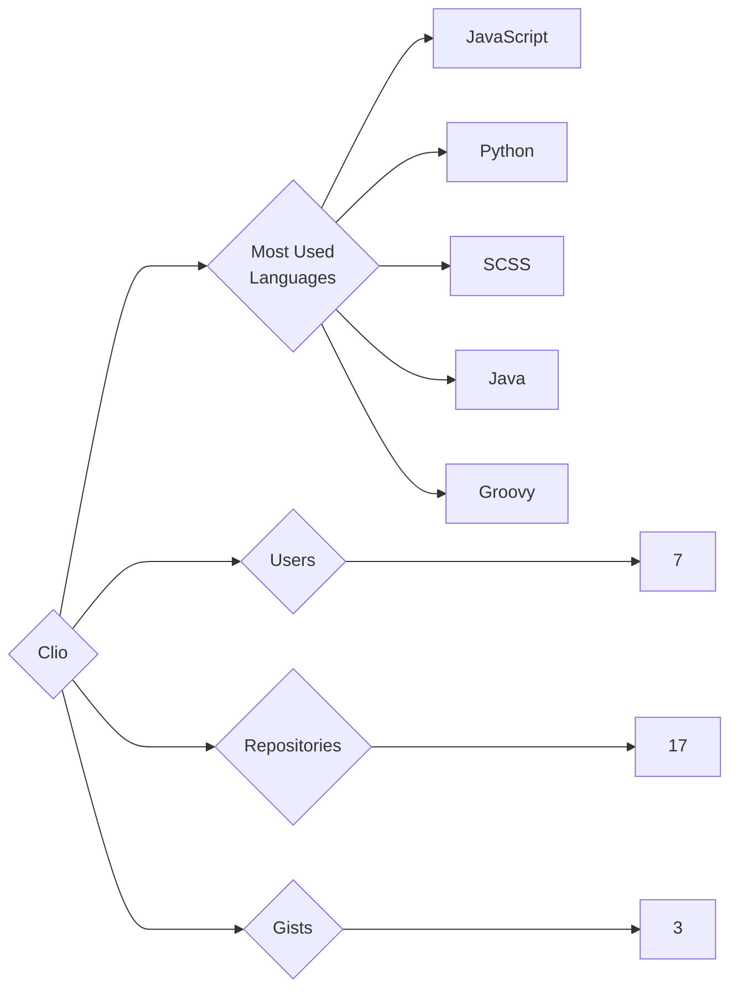

<h1 align="center">Clio</h1>

```mermaid
graph LR
COMPANY_NAME{Clio}
COMPANY_NAME ---> U{Users} ---> UN[7]
COMPANY_NAME ---> R{Repositories} ---> RN[17]
COMPANY_NAME ---> G{Gists} ---> GN[3]
COMPANY_NAME ---> ML{Most Used<br>Languages}
ML --> JavaScript[JavaScript]
ML --> Python[Python]
ML --> SCSS[SCSS]
ML --> Java[Java]
ML --> Groovy[Groovy]
```
