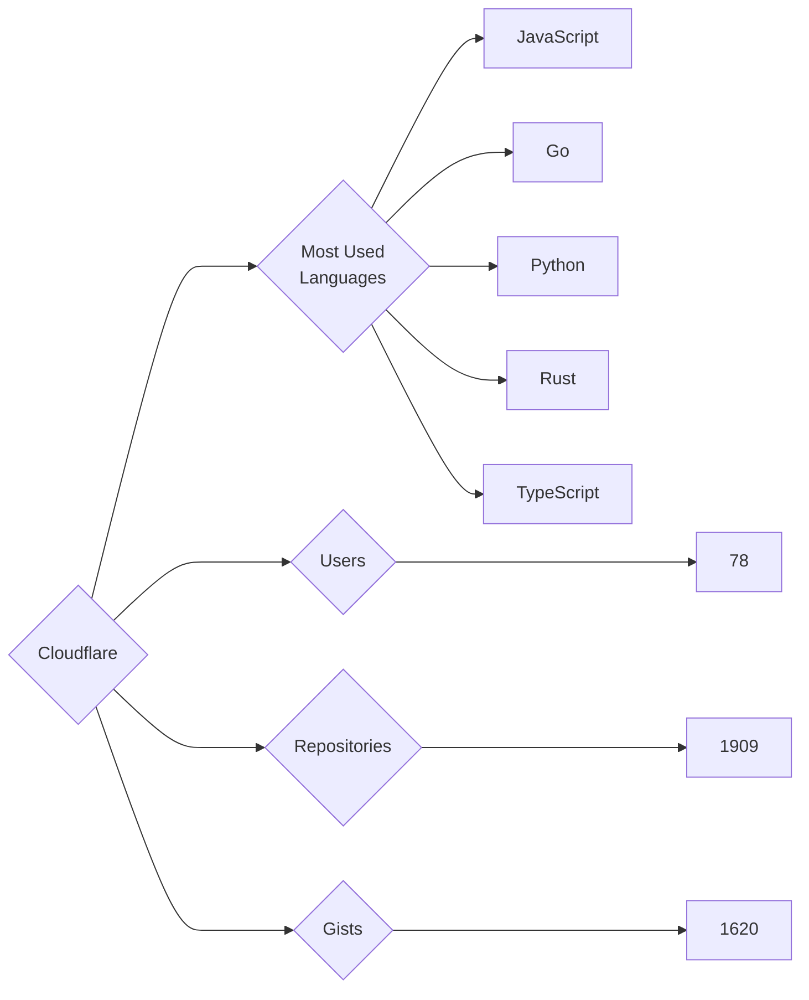

<h1 align="center">Cloudflare</h1>

```mermaid
graph LR
COMPANY_NAME{Cloudflare}
COMPANY_NAME ---> U{Users} ---> UN[78]
COMPANY_NAME ---> R{Repositories} ---> RN[1909]
COMPANY_NAME ---> G{Gists} ---> GN[1620]
COMPANY_NAME ---> ML{Most Used<br>Languages}
ML --> JavaScript[JavaScript]
ML --> Go[Go]
ML --> Python[Python]
ML --> Rust[Rust]
ML --> TypeScript[TypeScript]
```
