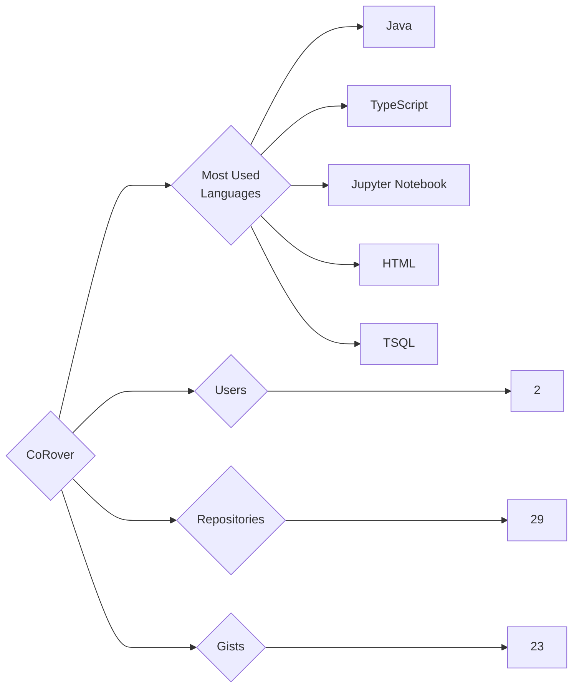

<h1 align="center">CoRover</h1>

```mermaid
graph LR
COMPANY_NAME{CoRover}
COMPANY_NAME ---> U{Users} ---> UN[2]
COMPANY_NAME ---> R{Repositories} ---> RN[29]
COMPANY_NAME ---> G{Gists} ---> GN[23]
COMPANY_NAME ---> ML{Most Used<br>Languages}
ML --> Java[Java]
ML --> TypeScript[TypeScript]
ML --> Jupyter_Notebook[Jupyter Notebook]
ML --> HTML[HTML]
ML --> TSQL[TSQL]
```
