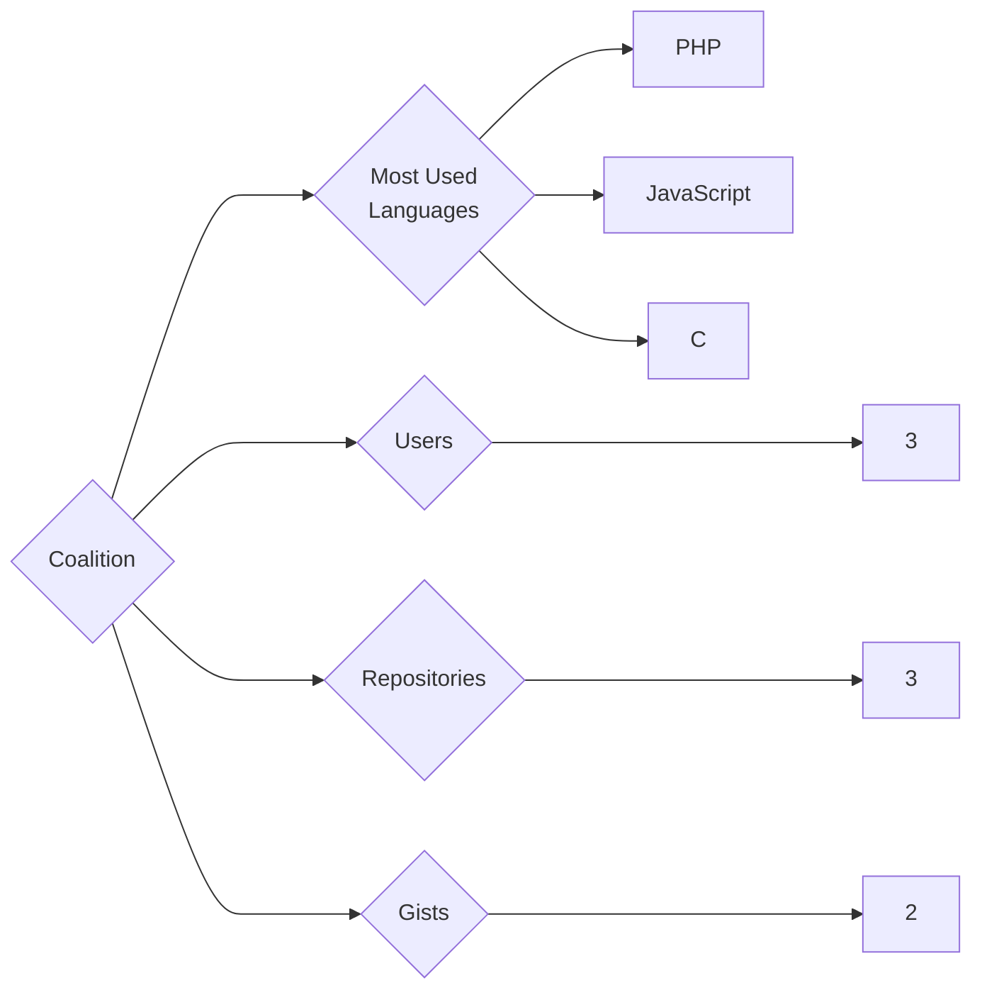

<h1 align="center">Coalition</h1>

```mermaid
graph LR
COMPANY_NAME{Coalition}
COMPANY_NAME ---> U{Users} ---> UN[3]
COMPANY_NAME ---> R{Repositories} ---> RN[3]
COMPANY_NAME ---> G{Gists} ---> GN[2]
COMPANY_NAME ---> ML{Most Used<br>Languages}
ML --> PHP[PHP]
ML --> JavaScript[JavaScript]
ML --> C[C]
```
