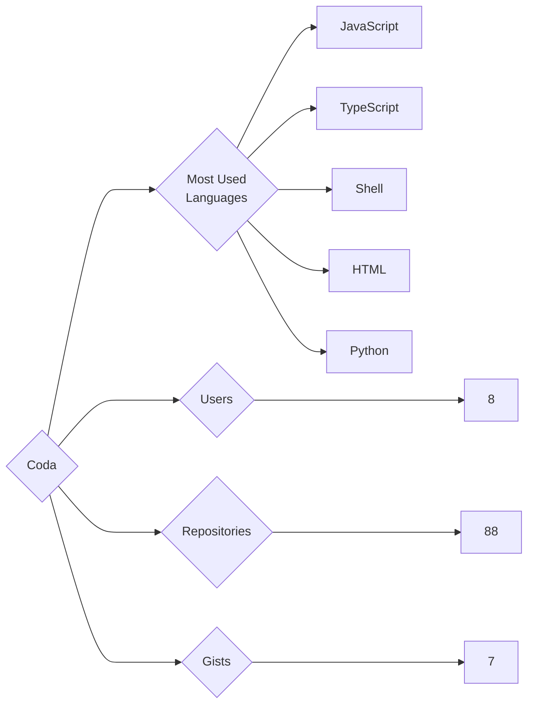

<h1 align="center">Coda</h1>

```mermaid
graph LR
COMPANY_NAME{Coda}
COMPANY_NAME ---> U{Users} ---> UN[8]
COMPANY_NAME ---> R{Repositories} ---> RN[88]
COMPANY_NAME ---> G{Gists} ---> GN[7]
COMPANY_NAME ---> ML{Most Used<br>Languages}
ML --> JavaScript[JavaScript]
ML --> TypeScript[TypeScript]
ML --> Shell[Shell]
ML --> HTML[HTML]
ML --> Python[Python]
```
