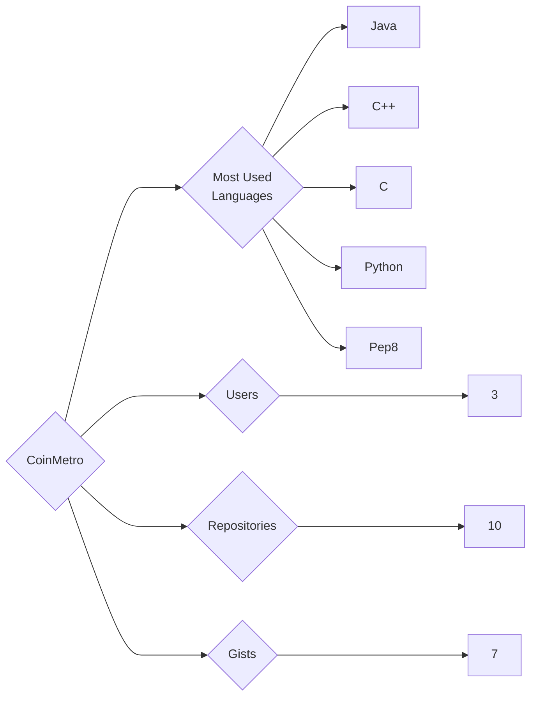

<h1 align="center">CoinMetro</h1>

```mermaid
graph LR
COMPANY_NAME{CoinMetro}
COMPANY_NAME ---> U{Users} ---> UN[3]
COMPANY_NAME ---> R{Repositories} ---> RN[10]
COMPANY_NAME ---> G{Gists} ---> GN[7]
COMPANY_NAME ---> ML{Most Used<br>Languages}
ML --> Java[Java]
ML --> C++[C++]
ML --> C[C]
ML --> Python[Python]
ML --> Pep8[Pep8]
```
