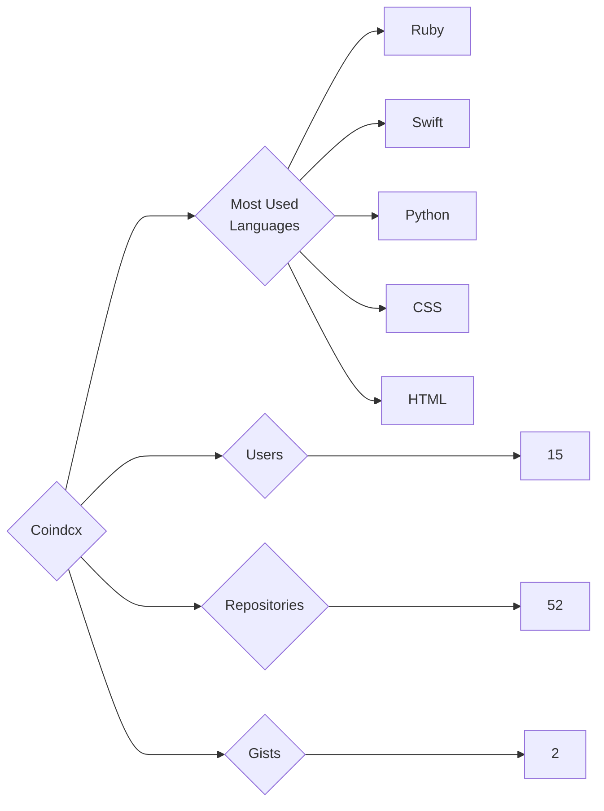

<h1 align="center">Coindcx</h1>

```mermaid
graph LR
COMPANY_NAME{Coindcx}
COMPANY_NAME ---> U{Users} ---> UN[15]
COMPANY_NAME ---> R{Repositories} ---> RN[52]
COMPANY_NAME ---> G{Gists} ---> GN[2]
COMPANY_NAME ---> ML{Most Used<br>Languages}
ML --> Ruby[Ruby]
ML --> Swift[Swift]
ML --> Python[Python]
ML --> CSS[CSS]
ML --> HTML[HTML]
```
