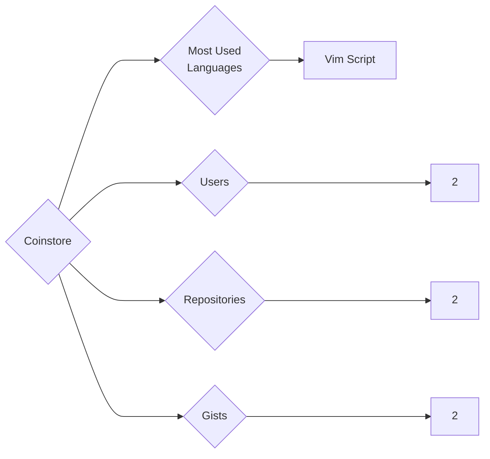

<h1 align="center">Coinstore</h1>

```mermaid
graph LR
COMPANY_NAME{Coinstore}
COMPANY_NAME ---> U{Users} ---> UN[2]
COMPANY_NAME ---> R{Repositories} ---> RN[2]
COMPANY_NAME ---> G{Gists} ---> GN[2]
COMPANY_NAME ---> ML{Most Used<br>Languages}
ML --> Vim_Script[Vim Script]
```
