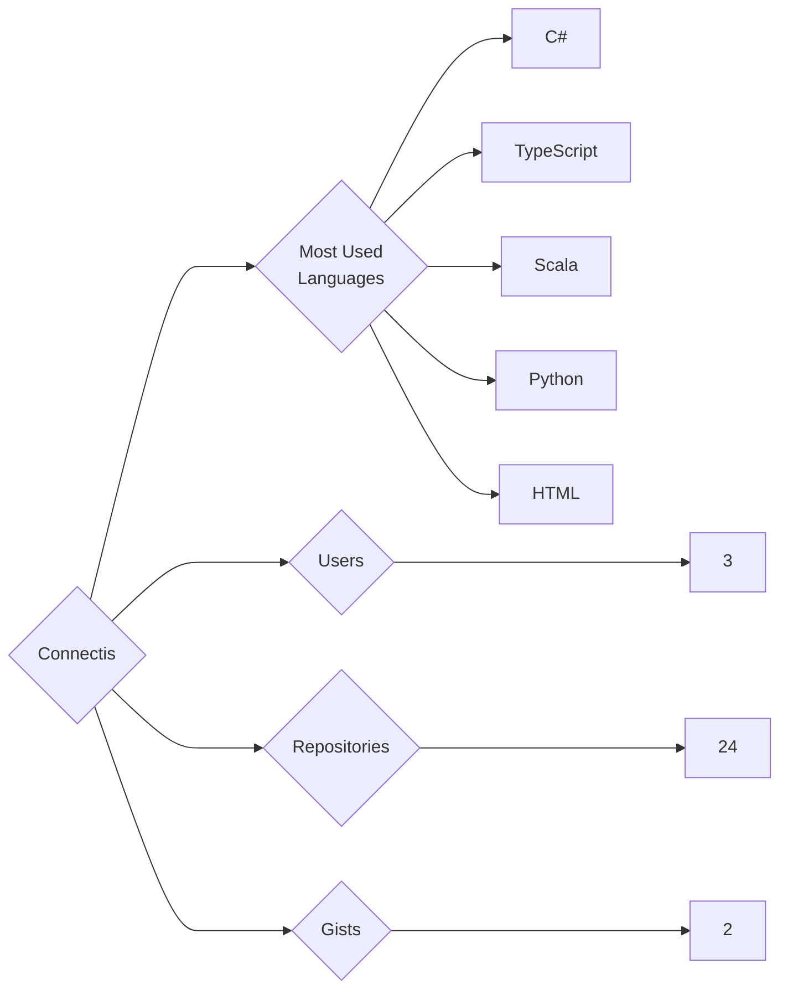

<h1 align="center">Connectis</h1>

```mermaid
graph LR
COMPANY_NAME{Connectis}
COMPANY_NAME ---> U{Users} ---> UN[3]
COMPANY_NAME ---> R{Repositories} ---> RN[24]
COMPANY_NAME ---> G{Gists} ---> GN[2]
COMPANY_NAME ---> ML{Most Used<br>Languages}
ML --> C#[C#]
ML --> TypeScript[TypeScript]
ML --> Scala[Scala]
ML --> Python[Python]
ML --> HTML[HTML]
```
