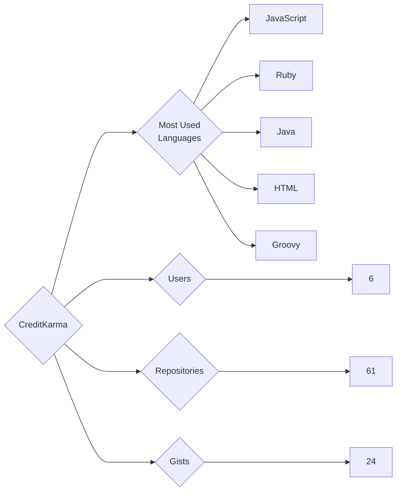

<h1 align="center">CreditKarma</h1>

```mermaid
graph LR
COMPANY_NAME{CreditKarma}
COMPANY_NAME ---> U{Users} ---> UN[6]
COMPANY_NAME ---> R{Repositories} ---> RN[61]
COMPANY_NAME ---> G{Gists} ---> GN[24]
COMPANY_NAME ---> ML{Most Used<br>Languages}
ML --> JavaScript[JavaScript]
ML --> Ruby[Ruby]
ML --> Java[Java]
ML --> HTML[HTML]
ML --> Groovy[Groovy]
```
