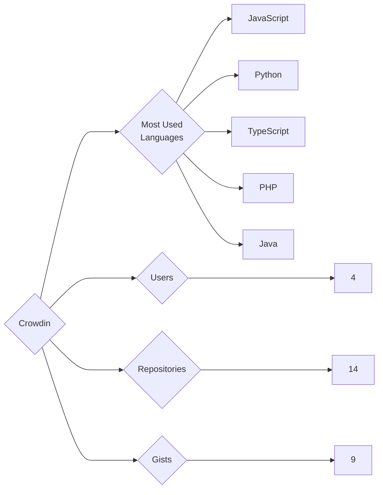

<h1 align="center">Crowdin</h1>

```mermaid
graph LR
COMPANY_NAME{Crowdin}
COMPANY_NAME ---> U{Users} ---> UN[4]
COMPANY_NAME ---> R{Repositories} ---> RN[14]
COMPANY_NAME ---> G{Gists} ---> GN[9]
COMPANY_NAME ---> ML{Most Used<br>Languages}
ML --> JavaScript[JavaScript]
ML --> Python[Python]
ML --> TypeScript[TypeScript]
ML --> PHP[PHP]
ML --> Java[Java]
```
