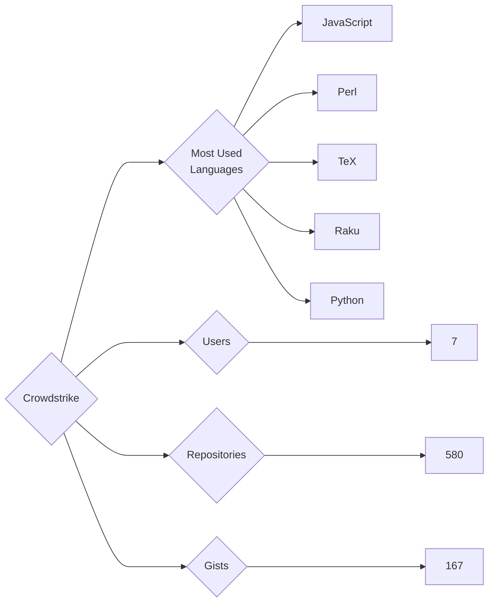

<h1 align="center">Crowdstrike</h1>

```mermaid
graph LR
COMPANY_NAME{Crowdstrike}
COMPANY_NAME ---> U{Users} ---> UN[7]
COMPANY_NAME ---> R{Repositories} ---> RN[580]
COMPANY_NAME ---> G{Gists} ---> GN[167]
COMPANY_NAME ---> ML{Most Used<br>Languages}
ML --> JavaScript[JavaScript]
ML --> Perl[Perl]
ML --> TeX[TeX]
ML --> Raku[Raku]
ML --> Python[Python]
```
