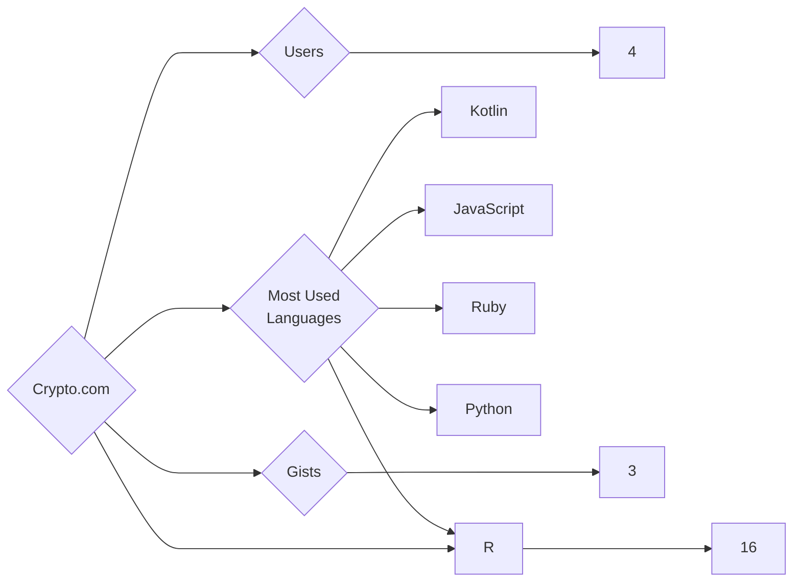

<h1 align="center">Crypto.com</h1>

```mermaid
graph LR
COMPANY_NAME{Crypto.com}
COMPANY_NAME ---> U{Users} ---> UN[4]
COMPANY_NAME ---> R{Repositories} ---> RN[16]
COMPANY_NAME ---> G{Gists} ---> GN[3]
COMPANY_NAME ---> ML{Most Used<br>Languages}
ML --> Kotlin[Kotlin]
ML --> JavaScript[JavaScript]
ML --> R[R]
ML --> Ruby[Ruby]
ML --> Python[Python]
```
